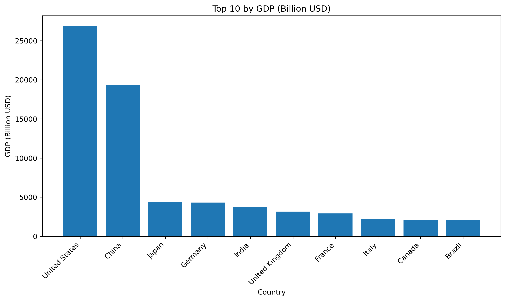

# GDP Web Scraping & Data Cleaning Project

This project scrapes GDP data from a Wikipedia page using pandas.read_html,
cleans the data, converts GDP from million USD to billion USD, and saves
the top 10 economies to a CSV file.
It is part of my learning journey in data analysis and Python.
---

##  Project Objectives

- Scrape table data from a Wikipedia archived webpage  
- Select the correct table and columns  
- Clean the data (remove commas, convert types)  
- Convert GDP from Million USD to Billion USD  
- Plot the top 10 economies using matplotlib  
- Export the cleaned data as CSV  

---

## Files in This Project

| File | Description |
|------|-------------|
| `wikipedia_gdp.ipynb` | Main Jupyter Notebook with all the code |
| `Largest_economies.csv` | Cleaned data exported from the notebook |
| `README.md` | Project documentation |

---

## Technologies Used

- Python  
- Pandas  
- NumPy  
- Matplotlib  
- Jupyter Notebook  

---

## Visualization Example

